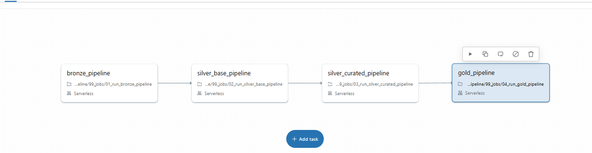
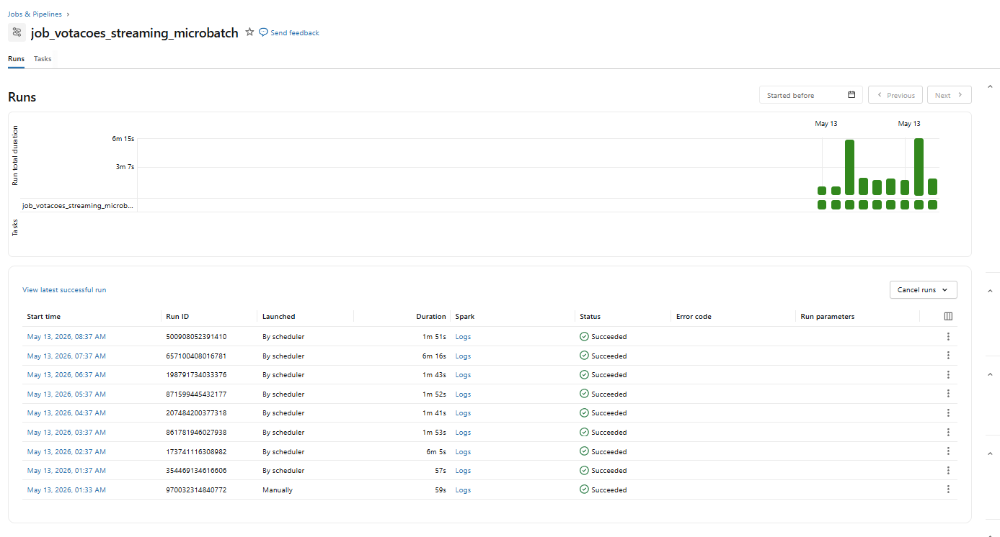
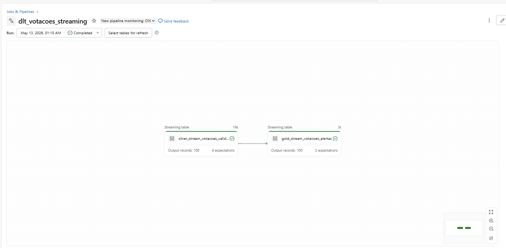

# camara-data-pipeline

<p align="left">
  
  
  
  
  
  
  
</p>

End-to-end lakehouse data engineering project built on Databricks using PySpark and Delta Lake for parliamentary analytics, governance, resiliency and dimensional modeling.

---

## Educational Purpose

This project was developed for educational, technical portfolio and data engineering study purposes.

The solution demonstrates enterprise-style Data Engineering concepts using public parliamentary datasets and modern Lakehouse architecture patterns.

No political affiliation, governmental endorsement or institutional relationship is implied.

The analytical interpretations and indicators presented in this repository are intended exclusively for technical demonstration, analytical experimentation and engineering architecture studies.

---

# Technologies Used

| Category | Technology |
|---|---|
| Platform | Databricks Free Edition |
| Languages | PySpark (Python) and Spark SQL |
| Storage | Delta Lake |
| Architecture | Medallion Architecture (Bronze, Silver, Gold) |
| Streaming | Delta Live Tables (DLT) and Micro-batch |
| Source API | Câmara dos Deputados Open Data API |
| Version Control | GitHub |
| Processing Engine | Apache Spark |
| Analytical Modeling | Star Schema / Dimensional Modeling |

---

## Platform

### Databricks Free Edition

Official page:

https://www.databricks.com/blog/introducing-databricks-free-edition

The project was developed using Databricks Lakehouse capabilities including:

* Delta Lake;
* Workflows;
* PySpark notebooks;
* Spark SQL;
* Streaming micro-batch;
* Delta Live Tables (DLT);
* medallion architecture implementation.

---

## Programming Languages

### PySpark (Python)

Used for:

* ingestion pipelines;
* transformations;
* quality validations;
* CDC processing;
* streaming processing;
* orchestration logic;
* analytical processing.

### Spark SQL

Used for:

* analytical views;
* Gold marts;
* dimensional modeling;
* aggregations;
* analytical products;
* quality checks.

---

## Data Source

### Câmara dos Deputados Open Data API

Official documentation:

https://dadosabertos.camara.leg.br/swagger/api.html

The API provides public parliamentary datasets including:

* deputies;
* expenses;
* propositions;
* parliamentary fronts;
* legislative events;
* organizations;
* voting sessions;
* voting orientations;
* voting votes;
* legislatures.

---

## Architecture Pattern

### Medallion Architecture

The project implements a Medallion Lakehouse Architecture with progressive data refinement:

| Layer | Responsibility |
|---|---|
| Bronze | Raw ingestion and replayability |
| Silver Base | Technical standardization and validations |
| Silver Curated | Business-oriented reusable entities |
| Gold | Dimensional modeling and analytical marts |
| Analytics | Parliamentary intelligence and analytical products |

---

## Additional Engineering Features

The project also implements:

* CDC / SCD Type 2;
* Delta Live Tables (DLT);
* streaming micro-batch ingestion;
* replay/reprocessing strategy;
* workflow orchestration;
* SLA monitoring;
* operational observability;
* lineage and governance patterns.

---

# Table of Contents

* [Overview](#overview)
* [Challenge Scope](#challenge-scope)
* [Data Sources and APIs](#data-sources-and-apis)
* [Architecture](#architecture)
* [Medallion Architecture](#medallion-architecture)
* [Streaming, CDC and DLT Architecture](#streaming-cdc-and-dlt-architecture)
* [Workflow Orchestration](#workflow-orchestration)
* [Gold Dimensional Model](#gold-dimensional-model)
* [Governance, Resilience and Analytics](#governance-resilience-and-analytics)
* [Main Analytics Delivered](#main-analytics-delivered)
* [Streaming and Parliamentary Intelligence](#streaming-and-parliamentary-intelligence)
* [Tech Stack](#tech-stack)
* [Repository Structure](#repository-structure)
* [Documentation Architecture](#documentation-architecture)
* [Data Quality and Lineage](#data-quality-and-lineage)
* [Incremental Processing and Replay](#incremental-processing-and-replay)
* [Supplier Enrichment and Anomaly Detection](#supplier-enrichment-and-anomaly-detection)
* [Analytical Considerations and Limitations](#analytical-considerations-and-limitations)
* [Future Improvements](#future-improvements)
* [Documentation](#documentation)
* [Author](#author)

---

# Overview

`camara-data-pipeline` is a modern lakehouse data engineering project designed to ingest, validate, curate and model open parliamentary data from the Brazilian Chamber of Deputies API.

The project was built using a medallion architecture pattern with progressive refinement across Bronze, Silver Base, Silver Curated, Gold and Analytics layers.

The solution focuses on:

* scalable ingestion pipelines;
* replayability and resiliency;
* dimensional modeling;
* governance and lineage;
* parliamentary intelligence analytics;
* analytical products for political and financial analysis;
* CDC and SCD Type 2 historization;
* streaming micro-batch processing;
* Delta Live Tables;
* workflow orchestration;
* SLA monitoring and operational observability.

---

# Challenge Scope

| Challenge Theme                      | Status              |
| ------------------------------------ | ------------------- |
| CEAP analytics                       | ✔                   |
| Parliamentary fronts                 | ✔                   |
| Legislative events                   | ✔                   |
| Voting analysis                      | ✔                   |
| Engagement score                     | ✔                   |
| Supplier enrichment                  | ✔                   |
| Z-score anomaly detection            | ✔                   |
| Governance & lineage                 | ✔                   |
| Replay & resiliency                  | ✔                   |
| CDC / SCD Type 2                     | Implemented Partial |
| Streaming micro-batch                | ✔                   |
| Delta Live Tables (DLT)              | ✔                   |
| SLA monitoring                       | ✔                   |
| Workflow orchestration               | ✔                   |
| Parliamentary Intelligence           | ✔                   |
| CPI analysis                         | Roadmap             |

---

# Data Sources and APIs

The project uses public parliamentary and governmental datasets to build a complete analytical lakehouse platform focused on Brazilian legislative activity.

---

## Main Data Source

### Câmara dos Deputados Open Data API

Official API:

https://dadosabertos.camara.leg.br/swagger/api.html

Main datasets consumed:

| Dataset | Endpoint |
|---|---|
| Deputies | `/deputados` |
| Deputy details | `/deputados/{id}` |
| Parliamentary fronts | `/frentes` |
| Front members | `/frentes/{id}/membros` |
| Legislative events | `/eventos` |
| Propositions | `/proposicoes` |
| Proposition processing | `/proposicoes/{id}/tramitacoes` |
| Expenses (CEAP) | `/deputados/{id}/despesas` |
| Organizations | `/orgaos` |
| Organization members | `/orgaos/{id}/membros` |
| Voting sessions | `/votacoes` |
| Voting orientations | `/votacoes/{id}/orientacoes` |
| Voting votes | `/votacoes/{id}/votos` |
| Legislatures | `/legislaturas` |

---

## Supplier Enrichment Source

### Receita Federal / Public CNPJ datasets

Used for:

* supplier enrichment;
* CPF/CNPJ validation;
* active/inactive supplier verification;
* anomaly support analysis;
* suspicious supplier detection.

---

## Data Consumption Strategy

The ingestion architecture combines:

* direct API ingestion;
* incremental ingestion;
* file-based replay ingestion;
* CDC ingestion;
* streaming micro-batch ingestion.

---

## API Engineering Features

Implemented ingestion controls include:

* pagination;
* retry strategy;
* timeout control;
* incremental processing;
* lineage generation;
* replay support;
* payload hashing;
* batch_id tracking;
* Delta persistence;
* operational logging.

---

## Streaming APIs

The streaming architecture continuously monitors:

| Streaming Dataset | Strategy |
|---|---|
| Voting sessions | Incremental micro-batch |
| Proposition processing | CDC / SCD Type 2 |

---

## API Observability

The project implements operational observability for API workloads through:

* monitoring.pipeline_log;
* SLA monitoring;
* execution logs;
* records_read;
* records_written;
* records_discarded;
* batch lineage;
* replay traceability.

---

# Architecture

The project follows a layered lakehouse architecture with progressive refinement of parliamentary data.

* Bronze preserves raw ingestion and replayability;
* Silver Base performs technical treatment and validations;
* Silver Curated prepares reusable business entities;
* Gold materializes dimensions, facts and analytical marts;
* Analytics delivers parliamentary intelligence products.


---

# Medallion Architecture

## Bronze

Raw ingestion layer preserving:

* API responses;
* metadata;
* batch lineage;
* replay history;
* ingestion traceability.

### Main characteristics

* raw Delta tables;
* pagination and retry;
* source metadata;
* replayable ingestion;
* ingestion lineage.

---

## Silver Base

Technical treatment layer responsible for:

* parsing;
* typing;
* structural validations;
* deduplication;
* rejected records handling;
* technical quality flags.

### Main characteristics

* technical standardization;
* explicit validations;
* deduplication logic;
* rejected records;
* Bronze lineage preservation.

---

## Silver Curated

Reusable business-oriented entities layer.

### Main characteristics

* lightweight business rules;
* fallback logic;
* textual standardization;
* Receita Federal supplier enrichment;
* reusable curated entities.

---

## Gold

Dimensional analytical layer responsible for:

* dimensions;
* facts;
* analytical marts;
* analytical views;
* parliamentary intelligence products.

### Main characteristics

* star schema modeling;
* surrogate keys;
* conformed dimensions;
* analytical scalability;
* optimized Delta tables.

---

## Analytics

Consumption-oriented analytical products.

### Main products

* CEAP analytics;
* anomaly detection;
* parliamentary fronts analytics;
* engagement score;
* political alignment analysis;
* parliamentary intelligence.

---

# Streaming, CDC and DLT Architecture

The project evolved beyond a traditional batch Medallion architecture and now also includes:

* incremental micro-batch ingestion;
* CDC pipelines;
* SCD Type 2 historization;
* Delta Live Tables (DLT);
* workflow orchestration;
* SLA monitoring;
* replay/reprocessing strategy;
* operational observability.

---

## Workflow Orchestration

The orchestration layer separates responsibilities between Bronze, Silver Base, Silver Curated, Gold and Streaming workloads using independent Databricks Workflows.

### Main characteristics

* layer isolation;
* execution dependency control;
* replay support;
* operational monitoring;
* workflow orchestration;
* scalable execution strategy.



---

## Streaming Micro-Batch Pipeline

The project implements a scheduled micro-batch pipeline responsible for continuously monitoring parliamentary voting events.

### Main characteristics

* incremental ingestion;
* offset control;
* replay/reprocessing;
* batch lineage;
* operational logging;
* raw payload preservation;
* execution observability.

### Implemented controls

* control.votacoes_stream_offset;
* bronze_stream.votacoes_raw;
* monitoring.pipeline_log;
* batch_id lineage;
* record_hash tracking.



---

## Delta Live Tables (DLT)

The streaming architecture also includes a Delta Live Tables pipeline implementing continuous Bronze → Silver → Gold processing.

### Main characteristics

* declarative expectations;
* streaming validations;
* automatic quality enforcement;
* Gold alert generation;
* SLA-oriented processing;
* observability integration.

### DLT expectations

* voting ID validation;
* timestamp validation;
* payload validation;
* hash validation;
* mandatory field validation.



---

## CDC / SCD Type 2

The project also implements CDC historization for parliamentary proposition processing.

### Main characteristics

* payload hash comparison;
* incremental historization;
* valid_from;
* valid_to;
* is_current;
* replay support;
* Delta Lake historization.

---

# Gold Dimensional Model

The Gold layer follows a reflected star schema approach with independent facts and reusable conformed dimensions.

### Main characteristics

* independent fact tables;
* reusable dimensions;
* analytical scalability;
* no fact-to-fact relationships;
* dimensional consistency.


---

# Governance, Resilience and Analytics

The project incorporates governance, resiliency and analytical observability patterns.

### Governance

* lineage preservation;
* batch_id traceability;
* records_read;
* records_written;
* records_discarded;
* explicit validations.

### Resiliency

* Bronze replayability;
* layer reprocessing;
* Delta Lake recovery;
* reconstruction from Curated layer;
* CDC replay strategy;
* streaming offset recovery.

### Analytics

* z-score anomaly detection;
* suspicious suppliers;
* parliamentary intelligence;
* analytical marts and views;
* SLA monitoring;
* streaming alerts;
* proposition processing historization.


---

# Main Analytics Delivered

## CEAP Analytics

* ranking of parliamentary expenses;
* category × UF analysis;
* suspicious suppliers;
* z-score anomaly detection;
* financial anomaly classification.

---

## Parliamentary Fronts

* HHI diversity analysis;
* overlap analysis;
* political alignment;
* concentration analysis.

---

## Voting Analytics

* party alignment;
* front alignment;
* orientation analysis;
* voting divergence.

---

## Legislative Events

* future legislative calendar;
* weekly density analysis;
* inactivity periods;
* attendance approximation.

---

## Parliamentary Engagement

Composite parliamentary engagement score based on:

* parliamentary activity;
* voting participation;
* attendance approximation;
* decisive participation proxy.

---

# Streaming and Parliamentary Intelligence

The project also includes advanced analytical and operational products beyond the original batch processing scope.

## Streaming Voting Alerts

* micro-batch voting monitoring;
* urgency classification;
* notification flag generation;
* Gold streaming alert layer;
* SLA-oriented monitoring.

---

## CDC Proposition Processing Analytics

* historical proposition processing tracking;
* SCD Type 2 versioning;
* current and historical state analysis;
* proposition processing alerts;
* time-to-process analytical views.

---

## Parliamentary Intelligence

Advanced analytical views include:

* parliamentary profile;
* party profile;
* transparency index;
* parliamentary efficiency index;
* thematic specialization;
* party spending behavior;
* executive party dashboard;
* parliamentary inefficiency analysis.

---

# Tech Stack

## Main Technologies

* Databricks
* PySpark
* Spark SQL
* Delta Lake
* Python
* GitHub
* Delta Live Tables

---

## Engineering Concepts

* Medallion Architecture
* Lakehouse
* Star Schema
* Dimensional Modeling
* Replayability
* Data Governance
* Parliamentary Intelligence
* CDC / SCD Type 2
* Delta Live Tables (DLT)
* Streaming Micro-batch
* Operational Observability
* SLA Monitoring
* Workflow Orchestration

---

# Repository Structure

```text
camara-data-pipeline/
│
├── assets/
│   └── images/
│
├── docs/
│   ├── notebooks_catalog.md
│   ├── challenge_matrix.md
│   ├── architecture_decisions.md
│   ├── streaming_architecture.md
│   ├── runbook.md
│   └── pdf/
│
├── notebooks/
│   ├── 00_setup/
│   ├── 01_bronze/
│   ├── 02_silver/
│   │   ├── 01_base/
│   │   └── 02_curated/
│   ├── 03_gold/
│   ├── 04_analytics/
│   ├── 05_dlt/
│   ├── 90_common/
│   └── 99_jobs/
│
├── requirements.txt
└── README.md
```

---

# Documentation Architecture

The project documentation follows an enterprise-style engineering documentation approach.

### Main goals

* onboarding support;
* architectural transparency;
* operational guidance;
* analytical explainability;
* replay/recovery procedures;
* technical governance;
* challenge defense support.

---

## Documentation Layers

| Layer | Responsibility |
|---|---|
| README.md | High-level architecture and project overview |
| notebooks_catalog.md | Notebook responsibilities and lineage |
| challenge_matrix.md | Detailed challenge adherence mapping |
| architecture_decisions.md | Technical and modeling decisions |
| streaming_architecture.md | Streaming and CDC operational design |
| runbook.md | Incident response and replay procedures |

---

## Engineering Documentation Principles

The documentation strategy prioritizes:

* technical clarity;
* reproducibility;
* governance transparency;
* architectural explainability;
* operational resilience;
* replay traceability;
* analytical reproducibility.

---

# Data Quality and Lineage

The project implements explicit governance and quality patterns.

### Main controls

* records_read;
* records_written;
* records_discarded;
* rejected records;
* explicit validations;
* raise Exception validations;
* deterministic deduplication;
* analytical range validations;
* DLT declarative expectations;
* streaming quality validation;
* CDC payload hash comparison.

### Lineage metadata

Preserved across layers:

* bronze_ts_ingestao
* bronze_dt_ingestao
* bronze_tx_endpoint
* bronze_id_batch
* bronze_tx_record_hash
* bronze_tx_source_file
* bronze_nr_ano_referencia

Additional operational lineage:

* batch_id;
* record_hash;
* source endpoint;
* source payload;
* streaming offset;
* valid_from;
* valid_to;
* is_current.

---

# Incremental Processing and Replay

The architecture supports:

* replay from Bronze;
* layer reprocessing;
* batch reconstruction;
* historical recovery;
* replayable ingestion;
* CDC historization;
* streaming offset recovery;
* micro-batch reprocessing.

### Resiliency characteristics

* replayable Bronze layer;
* Curated reconstruction;
* Delta Lake recovery;
* batch traceability;
* operational resiliency;
* CDC payload comparison;
* DLT quality expectations;
* monitoring-driven replay strategy.

---

# Supplier Enrichment and Anomaly Detection

The project enriches parliamentary expense suppliers using public Receita Federal CNPJ data.

### Main enrichments

* CPF/CNPJ classification;
* supplier enrichment;
* active/inactive CNPJ validation;
* suspicious supplier detection.

### Financial anomaly detection

Implemented using z-score analytics:

* expected behavior;
* possible anomaly;
* extreme anomaly;
* critical anomaly with suspicious suppliers.

---

# Analytical Considerations and Limitations

## Future Evolution — CPI Analytics

The current architecture already supports CPI-related analysis through
organs, events, propositions and parliamentary participation datasets.

However, a complete investigative lifecycle model for CPIs
(start, progress, reports, generated propositions and closure timeline)
was intentionally documented as a future evolution due to project scope prioritization.

---

## CDC / SCD Type 2 Interpretation

The CDC/SCD2 implementation provides a functional historical structure for proposition processing events using payload hash comparison and versioning fields.

The historical reconstruction quality depends on recurring executions, Delta retention configuration and operational continuity.

---

## Streaming Interpretation

The streaming implementation uses a micro-batch pattern for parliamentary voting monitoring.

The architecture provides near-real-time operational behavior, offset control, replay capability and SLA monitoring, but the actual freshness depends on the configured Databricks job schedule and API availability.

---

## Supplier CNPJ Validation Disclaimer

Some supplier records may contain the classification `NOT_VALIDATED`.

This status does not indicate fraud or invalid suppliers.
It only means that the project could not conclusively validate the
supplier identifier using the available processing and validation rules.

---

## Party Loyalty Interpretation

The party loyalty indicator should be interpreted as a behavioral proxy
based on alignment between parliamentary votes and party orientation records.

It does not fully represent political influence, negotiation context
or strategic parliamentary decisions.

---

## Event Presence Granularity Limitation

Parliamentary event attendance is based on nominal participation records
available in the Câmara datasets.

The absence of a nominal participation record does not necessarily mean
that the parliamentarian was absent from the event.

---

# Future Improvements

Planned future evolutions include:

* complete CPI lifecycle analytics;
* advanced realtime parliamentary monitoring;
* external political datasets integration;
* speech and sentiment analytics;
* advanced temporal political alignment analytics;
* predictive parliamentary behavior analytics;
* advanced operational dashboards;
* automated alert integrations.

---

## Already Implemented Advanced Features

The following advanced engineering features are already implemented in the current version:

* CDC / SCD Type 2;
* streaming micro-batch ingestion;
* Delta Live Tables (DLT);
* workflow orchestration;
* SLA monitoring;
* replay/reprocessing strategy;
* operational observability;
* parliamentary intelligence analytics.

---

# Documentation

Additional technical documentation is available under:

```text
docs/
```

Main documentation files:

| Document | Description |
|---|---|
| notebooks_catalog.md | Complete notebook catalog and responsibilities |
| challenge_matrix.md | Detailed challenge adherence matrix |
| architecture_decisions.md | Architectural and modeling decisions |
| streaming_architecture.md | Streaming, CDC and DLT architecture |
| runbook.md | Operational recovery and replay procedures |
| guia_projeto_camaradatapipeline.pdf | Full technical project guide |
| estudo_matriz_aderencia.pdf | Complete challenge adherence study |

---

## Documentation Coverage

The documentation includes:

* architecture decisions;
* medallion architecture;
* dimensional modeling;
* governance;
* lineage;
* replay/reprocessing;
* streaming architecture;
* CDC / SCD Type 2;
* Delta Live Tables (DLT);
* workflow orchestration;
* SLA monitoring;
* operational observability;
* analytical products;
* notebook responsibilities;
* technical standards;
* runbooks;
* evidences and diagrams.

---

## Evidence Images

Operational evidence images available under:

```text
assets/images/
```

Including:

* medallion architecture;
* workflow orchestration;
* DLT streaming pipeline;
* streaming micro-batch execution;
* governance architecture;
* dimensional model diagrams.

---

# Author

Bruno Souza

Data Engineer focused on scalable data platforms, governance, dimensional modeling and modern analytical lakehouse architectures.