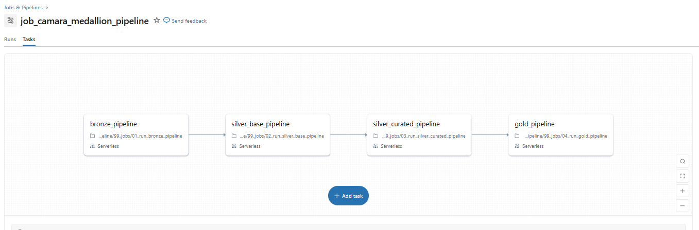
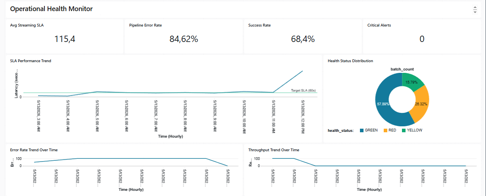
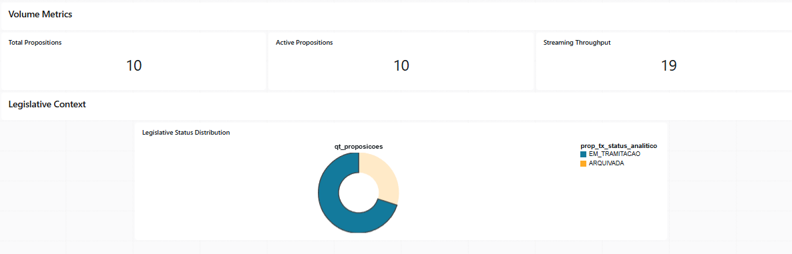

# Camara Data Pipeline — Parliamentary Lakehouse Platform

Enterprise-style Lakehouse Data Engineering platform fully implemented natively on Databricks for large-scale parliamentary analytics using PySpark, Delta Lake, Delta Live Tables (DLT), streaming micro-batch ingestion, CDC/SCD Type 2 processing, multi-endpoint REST APIs and Medallion architecture.

<p align="left">
  
  
  
  
  
  
  
  
</p>

🇧🇷 Portuguese version: [README.pt-BR.md](README.pt-BR.md)

---

# Educational Purpose

This project was developed for educational, portfolio and technical study purposes.

The repository demonstrates enterprise-oriented Data Engineering concepts using public parliamentary datasets and modern Lakehouse architecture patterns.

No political affiliation, governmental endorsement or institutional relationship is implied.

All analytical indicators and intelligence layers were created exclusively for technical demonstration, analytical experimentation and engineering architecture studies.

---

# Why This Project Is Different

Unlike traditional portfolio ETL projects, this solution implements:

* multi-endpoint distributed REST ingestion;
* replayable Medallion Lakehouse architecture;
* deterministic lineage and batch tracking;
* CDC / SCD Type 2 historization;
* streaming micro-batch ingestion;
* Delta Live Tables (DLT);
* SLA monitoring and operational observability;
* supplier enrichment using public CNPJ datasets;
* parliamentary intelligence analytical marts;
* anomaly detection and behavioral analytics;
* governance-oriented replay and recovery strategy;
* enterprise-style technical documentation.

The project was designed to simulate real-world enterprise Data Engineering architecture patterns rather than isolated ETL scripts.

---

# Engineering Highlights

| Capability | Implementation |
|---|---|
| Multi-endpoint REST ingestion | Câmara dos Deputados Open Data API |
| Streaming micro-batch | Parliamentary voting ingestion |
| CDC / SCD Type 2 | Proposition processing historization |
| Delta Live Tables | Streaming Bronze → Silver → Gold pipeline |
| Replayability | Replayable Bronze ingestion and lineage |
| Governance | Batch tracking and deterministic hashes |
| SLA Monitoring | Streaming operational metrics |
| Supplier enrichment | Public Brazilian CNPJ datasets |
| Parliamentary intelligence | Analytical Gold marts |
| Anomaly detection | Z-score expenditure analysis |
| Workflow orchestration | Databricks Workflows |
| Observability | Monitoring tables and execution logs |

---

# Technologies Used

| Category | Technology |
|---|---|
| Platform | Databricks Free Edition |
| Languages | PySpark (Python) and Spark SQL |
| Processing Engine | Apache Spark |
| Storage | Delta Lake |
| Architecture | Medallion Lakehouse Architecture |
| Streaming | Delta Live Tables (DLT) and Micro-batch |
| APIs | REST APIs |
| Version Control | GitHub |
| Modeling | Star Schema / Dimensional Modeling |
| Observability | Operational monitoring tables |
| Governance | Replayable lineage architecture |

---

# Main Data Sources

## Câmara dos Deputados Open Data API

Official documentation:

https://dadosabertos.camara.leg.br/swagger/api.html

---

## Main Consumed Endpoints

| Domain | Endpoint |
|---|---|
| Deputies | `/deputados` |
| Deputy details | `/deputados/{id}` |
| Parliamentary expenses | `/deputados/{id}/despesas` |
| Parliamentary fronts | `/frentes` |
| Front members | `/frentes/{id}/membros` |
| Legislative events | `/eventos` |
| Propositions | `/proposicoes` |
| Proposition processing | `/proposicoes/{id}/tramitacoes` |
| Organizations | `/orgaos` |
| Organization members | `/orgaos/{id}/membros` |
| Voting sessions | `/votacoes` |
| Voting votes | `/votacoes/{id}/votos` |
| Voting orientations | `/votacoes/{id}/orientacoes` |
| Legislatures | `/legislaturas` |

---

## External Enrichment Sources

The project also integrates external public datasets for analytical enrichment.

### Supplier Enrichment

Public Brazilian CNPJ datasets from the Brazilian Federal Revenue Service (Receita Federal do Brasil) are used to:

- validate suppliers;
- classify CPF/CNPJ entities;
- identify active/inactive suppliers;
- support anomaly detection;
- improve CEAP expenditure analytics.

### Data Source

- Brazilian Federal Revenue Service (Receita Federal do Brasil)
- Public CNPJ dataset:
  https://dadosabertos.rfb.gov.br/CNPJ/

This enrichment layer simulates real-world enterprise master data integration patterns.

---

# Overview

`camara-data-pipeline` is a modern Lakehouse Data Engineering platform designed to ingest, validate, curate and analytically model parliamentary open data from the Brazilian Chamber of Deputies ecosystem.

The architecture follows a progressive Medallion refinement strategy across:

* Bronze;
* Silver Base;
* Silver Curated;
* Gold;
* Analytics.

The platform combines:

* scalable API ingestion;
* replayable pipelines;
* governance and lineage;
* dimensional modeling;
* streaming ingestion;
* CDC / SCD Type 2;
* Delta Live Tables;
* operational observability;
* parliamentary intelligence analytics.

---

# Architecture

The platform follows a layered Lakehouse architecture with progressive data refinement and replayability.

```text
Bronze
    │
    ▼
Silver Base
    │
    ▼
Silver Curated
    │
    ▼
Gold
    │
    ▼
Analytics
```

---

## Architecture Principles

The architecture was designed around the following principles:

* replay-first ingestion;
* raw data preservation;
* deterministic processing;
* explicit validations;
* analytical scalability;
* governance-oriented lineage;
* operational observability;
* modular pipeline design.

---

## Architecture Diagram


---

# Streaming, CDC and DLT

The project implements advanced modern Data Engineering capabilities.

## Implemented Components

* streaming micro-batch ingestion;
* Delta Live Tables (DLT);
* CDC / SCD Type 2;
* proposition historization;
* workflow orchestration;
* SLA monitoring;
* replay and recovery strategy;
* operational observability;
* streaming lineage tracking.

---

## Workflow Orchestration



---

## Streaming Micro-Batch


---

## Delta Live Tables


---
## Real-Time Legislative Pipeline Observability

The project implements an enterprise operational observability dashboard for streaming legislative pipelines executed on Databricks.

The solution provides:

- end-to-end SLA monitoring;
- throughput monitoring;
- execution error-rate tracking;
- operational health classification;
- streaming pipeline observability.

### Dashboard Overview



*Enterprise operational observability dashboard for streaming legislative workloads.*



*Streaming throughput and legislative operational monitoring indicators.*

### Additional Documentation

| Document | Description |
|---|---|
| [streaming_sla_observability.md](docs/streaming_sla_observability.md) | SLA monitoring and operational observability |
| [streaming_architecture.md](docs/streaming_architecture.md) | Streaming architecture and DLT orchestration |

---

# Parliamentary Intelligence Analytics

The Gold and Analytics layers implement advanced parliamentary intelligence analytical marts.

## Main Analytical Domains

* parliamentary expenses analytics;
* voting analytics;
* transparency indicators;
* parliamentary efficiency indicators;
* supplier intelligence;
* political alignment analytics;
* parliamentary engagement score;
* anomaly detection;
* parliamentary front analytics;
* party analytical dashboards.

---

## Gold Dimensional Model


---

## Main Analytical Capabilities

| Capability | Description |
|---|---|
| CEAP Analytics | Parliamentary expense analysis |
| Supplier Intelligence | Supplier enrichment and validation |
| Transparency Index | Parliamentary transparency indicators |
| Efficiency Index | Parliamentary efficiency indicators |
| Voting Analytics | Voting behavior and party alignment |
| Party Intelligence | Political party analytical dashboards |
| Front Analytics | Parliamentary front concentration analysis |
| Engagement Score | Parliamentary participation metrics |
| Z-Score Analytics | Expenditure anomaly detection |

---

Detailed analytical documentation is available at:

[parliamentary_intelligence.md](docs/parliamentary_intelligence.md)

[gold_layer_enterprise_data_dictionary.md](docs/gold_layer_enterprise_data_dictionary.md)

---

# Governance, Replay and Observability

The architecture preserves governance, lineage and replayability across all processing layers.

## Main Implemented Concepts

* replayable Bronze ingestion;
* batch lineage tracking;
* deterministic record hashes;
* operational monitoring;
* rejected records handling;
* replay and recovery support;
* CDC historization;
* streaming offset tracking;
* SLA monitoring;
* operational logging.

---

## Governance Diagram


---

Detailed governance documentation is available at:

[governance_and_lineage.md](docs/governance_and_lineage.md)

[replay_strategy.md](docs/replay_strategy.md)

[runbook.md](docs/runbook.md)

---

# Repository Structure

```text
camara-data-pipeline/
│
├── README.md
├── README.pt-BR.md
│
├── docs/
│   ├── index.md
│   ├── streaming_architecture.md
│   ├── governance_and_lineage.md
│   ├── replay_strategy.md
│   ├── gold_layer_enterprise_data_dictionary.md
│   ├── parliamentary_intelligence.md
│   ├── notebooks_catalog.md
│   ├── architecture_decisions.md
│   ├── challenge_matrix.md
│   ├── analytical_data_products.md
│   ├── final_challenge_adherence_matrix.md
│   ├── notebook_engineering_standards.md
│   └── runbook.md
│
├── assets/
│   └── images/
│
├── data/
│   └── parliamentary_intelligence/
│       ├── ceap/
│       ├── frentes/
│       ├── eventos/
│       ├── votacoes/
│       ├── engajamento/
│       ├── partidos/
│       ├── cdc/
│       └── streaming/
│
├── notebooks/
│   ├── 00_setup/
│   ├── 01_bronze/
│   ├── 02_silver/
│   ├── 03_gold/
│   ├── 04_analytics/
│   ├── 05_dlt/
│   ├── 90_common/
│   ├── 93_admin/
│   └── 99_jobs/
│
└── requirements.txt
```

---

# Analytical Data Products

The repository also includes analytical CSV exports generated from Gold views and Parliamentary Intelligence datasets for reproducibility and delivery evidence.

Detailed export catalog documentation is available at:

[analytical_data_products.md](docs/analytical_data_products.md)

---

# Notebook Construction Standards

The project adopts a standardized notebook construction model defining:

* notebook structure;
* operational logging flow;
* lineage registration;
* validation flow;
* Delta persistence;
* rejected records handling;
* CDC/SCD2 notebook patterns;
* streaming notebook structure.

Detailed notebook construction documentation is available at:

[notebook_engineering_standards.md](docs/notebook_engineering_standards.md)

---

# Documentation

Detailed technical documentation is available under:

```text
docs/
```

| Document | Description |
|---|---|
| [streaming_architecture.md](docs/streaming_architecture.md) | Streaming, CDC, DLT and SLA architecture |
| [governance_and_lineage.md](docs/governance_and_lineage.md) | Governance, lineage and observability |
| [replay_strategy.md](docs/replay_strategy.md) | Replay and recovery strategy |
| [parliamentary_intelligence.md](docs/parliamentary_intelligence.md) | Parliamentary analytics and intelligence |
| [gold_layer_enterprise_data_dictionary.md](docs/gold_layer_enterprise_data_dictionary.md) | Enterprise Gold layer dimensional data dictionary |
| [architecture_decisions.md](docs/architecture_decisions.md) | Architecture and modeling decisions |
| [challenge_matrix.md](docs/challenge_matrix.md) | Challenge adherence matrix |
| [analytical_data_products.md](docs/analytical_data_products.md) | Analytical CSV exports catalog |
| [notebook_engineering_standards.md](docs/notebook_engineering_standards.md) | Standard notebook construction patterns |
| [final_challenge_adherence_matrix.md](docs/final_challenge_adherence_matrix.md) | Final challenge adherence mapping |
| [runbook.md](docs/runbook.md) | Operational incident procedures |
| [notebooks_catalog.md](docs/notebooks_catalog.md) | Notebook catalog and responsibilities |
| [streaming_sla_observability.md](docs/streaming_sla_observability.md) | Operational observability architecture, streaming SLA monitoring and operational dashboard |

---

# Engineering Goals

The project was designed to simulate enterprise-grade Data Engineering architecture patterns using modern Lakehouse, streaming and analytical engineering practices on Databricks.

---

# Final Challenge Adherence Matrix

The project includes a complete adherence matrix mapping the Databricks final challenge requirements to the implemented pipelines, analytical products, Gold dimensional models, streaming architecture and Parliamentary Intelligence capabilities.

## Document

[Final Challenge Adherence Matrix](docs/final_challenge_adherence_matrix.md)

## Covered Areas

* Medallion Architecture (Bronze / Silver / Gold);
* Gold Star Schema dimensional modeling;
* CEAP parliamentary expense analytics;
* Parliamentary fronts analytics;
* Voting intelligence and party alignment;
* Legislative events analytics;
* Parliamentary engagement analytics;
* CDC / SCD Type 2 historization;
* Streaming pipelines with DLT / Lakeflow;
* SLA monitoring and observability;
* Metadata governance and validation;
* Parliamentary Intelligence analytical products.

---

# Author

Bruno Souza

Data Engineer focused on scalable analytical platforms, governance, Lakehouse architecture, dimensional modeling and modern Data Engineering practices.