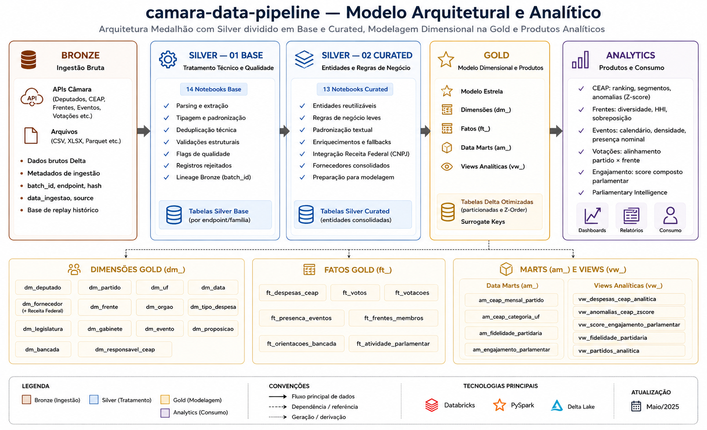
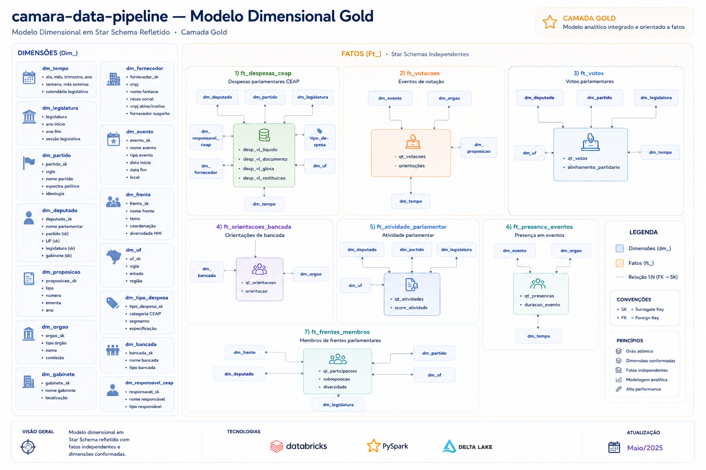
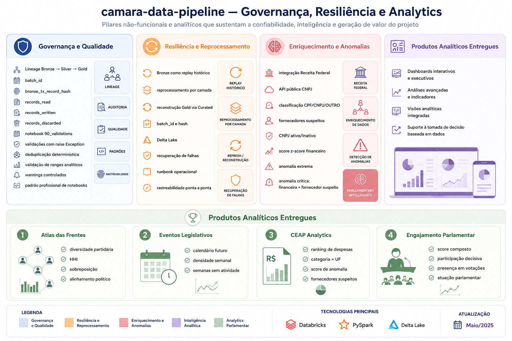

# camara-data-pipeline


End-to-end lakehouse data engineering project built on Databricks using PySpark and Delta Lake for parliamentary analytics, governance, resiliency and dimensional modeling.

---

# Table of Contents

* [Overview](#overview)
* [Challenge Scope](#challenge-scope)
* [Architecture](#architecture)
* [Medallion Architecture](#medallion-architecture)
* [Gold Dimensional Model](#gold-dimensional-model)
* [Governance, Resilience and Analytics](#governance-resilience-and-analytics)
* [Main Analytics Delivered](#main-analytics-delivered)
* [Tech Stack](#tech-stack)
* [Repository Structure](#repository-structure)
* [Data Quality and Lineage](#data-quality-and-lineage)
* [Incremental Processing and Replay](#incremental-processing-and-replay)
* [Supplier Enrichment and Anomaly Detection](#supplier-enrichment-and-anomaly-detection)
* [Analytical Considerations and Limitations](#analytical-considerations-and-limitations)
* [Future Improvements](#future-improvements)
* [Documentation](#documentation)
* [Author](#author)

---

# Overview

`camara-data-pipeline` is a modern lakehouse data engineering project designed to ingest, validate, curate and model open parliamentary data from the Brazilian Chamber of Deputies API.

The project was built using a medallion architecture pattern with progressive refinement across Bronze, Silver Base, Silver Curated, Gold and Analytics layers.

The solution focuses on:

* scalable ingestion pipelines;
* replayability and resiliency;
* dimensional modeling;
* governance and lineage;
* parliamentary intelligence analytics;
* analytical products for political and financial analysis.

---

# Challenge Scope

| Challenge Theme           | Status  |
| ------------------------- | ------- |
| CEAP analytics            | ✔       |
| Parliamentary fronts      | ✔       |
| Legislative events        | ✔       |
| Voting analysis           | ✔       |
| Engagement score          | ✔       |
| Supplier enrichment       | ✔       |
| Z-score anomaly detection | ✔       |
| Governance & lineage      | ✔       |
| Replay & resiliency       | ✔       |
| CPI analysis              | Roadmap |

---

# Architecture

The project follows a layered lakehouse architecture with progressive refinement of parliamentary data.

* Bronze preserves raw ingestion and replayability;
* Silver Base performs technical treatment and validations;
* Silver Curated prepares reusable business entities;
* Gold materializes dimensions, facts and analytical marts;
* Analytics delivers parliamentary intelligence products.



---

# Medallion Architecture

## Bronze

Raw ingestion layer preserving:

* API responses;
* metadata;
* batch lineage;
* replay history;
* ingestion traceability.

### Main characteristics

* raw Delta tables;
* pagination and retry;
* source metadata;
* replayable ingestion;
* ingestion lineage.

---

## Silver Base

Technical treatment layer responsible for:

* parsing;
* typing;
* structural validations;
* deduplication;
* rejected records handling;
* technical quality flags.

### Main characteristics

* technical standardization;
* explicit validations;
* deduplication logic;
* rejected records;
* Bronze lineage preservation.

---

## Silver Curated

Reusable business-oriented entities layer.

### Main characteristics

* lightweight business rules;
* fallback logic;
* textual standardization;
* Receita Federal supplier enrichment;
* reusable curated entities.

---

## Gold

Dimensional analytical layer responsible for:

* dimensions;
* facts;
* analytical marts;
* analytical views;
* parliamentary intelligence products.

### Main characteristics

* star schema modeling;
* surrogate keys;
* conformed dimensions;
* analytical scalability;
* optimized Delta tables.

---

## Analytics

Consumption-oriented analytical products.

### Main products

* CEAP analytics;
* anomaly detection;
* parliamentary fronts analytics;
* engagement score;
* political alignment analysis;
* parliamentary intelligence.

---

# Gold Dimensional Model

The Gold layer follows a reflected star schema approach with independent facts and reusable conformed dimensions.

### Main characteristics

* independent fact tables;
* reusable dimensions;
* analytical scalability;
* no fact-to-fact relationships;
* dimensional consistency.



---

# Governance, Resilience and Analytics

The project incorporates governance, resiliency and analytical observability patterns.

### Governance

* lineage preservation;
* batch_id traceability;
* records_read;
* records_written;
* records_discarded;
* explicit validations.

### Resiliency

* Bronze replayability;
* layer reprocessing;
* Delta Lake recovery;
* reconstruction from Curated layer.

### Analytics

* z-score anomaly detection;
* suspicious suppliers;
* parliamentary intelligence;
* analytical marts and views.



---

# Main Analytics Delivered

## CEAP Analytics

* ranking of parliamentary expenses;
* category × UF analysis;
* suspicious suppliers;
* z-score anomaly detection;
* financial anomaly classification.

---

## Parliamentary Fronts

* HHI diversity analysis;
* overlap analysis;
* political alignment;
* concentration analysis.

---

## Voting Analytics

* party alignment;
* front alignment;
* orientation analysis;
* voting divergence.

---

## Legislative Events

* future legislative calendar;
* weekly density analysis;
* inactivity periods;
* attendance approximation.

---

## Parliamentary Engagement

Composite parliamentary engagement score based on:

* parliamentary activity;
* voting participation;
* attendance approximation;
* decisive participation proxy.

---

# Tech Stack

## Main Technologies

* Databricks
* PySpark
* Spark SQL
* Delta Lake
* Python
* GitHub

---

## Engineering Concepts

* Medallion Architecture
* Lakehouse
* Star Schema
* Dimensional Modeling
* Replayability
* Data Governance
* Parliamentary Intelligence

---

# Repository Structure

```text
camara-data-pipeline/
│
├── assets/
├── configs/
├── docs/
│   ├── analytics/
│   ├── arquitetura/
│   ├── diagramas/
│   ├── evidencias/
│   └── runbooks/
│
├── notebooks/
│   ├── 00_setup/
│   ├── 01_bronze/
│   ├── 02_silver/
│   │   ├── 01_base/
│   │   └── 02_curated/
│   ├── 03_gold/
│   ├── 04_analytics/
│   ├── 90_common/
│   └── 99_jobs/
│
├── sql/
├── requirements.txt
└── README.md
```

---

# Data Quality and Lineage

The project implements explicit governance and quality patterns.

### Main controls

* records_read;
* records_written;
* records_discarded;
* rejected records;
* explicit validations;
* raise Exception validations;
* deterministic deduplication;
* analytical range validations.

### Lineage metadata

Preserved across layers:

* bronze_ts_ingestao
* bronze_dt_ingestao
* bronze_tx_endpoint
* bronze_id_batch
* bronze_tx_record_hash
* bronze_tx_source_file
* bronze_nr_ano_referencia

---

# Incremental Processing and Replay

The architecture supports:

* replay from Bronze;
* layer reprocessing;
* batch reconstruction;
* historical recovery;
* replayable ingestion.

### Resiliency characteristics

* replayable Bronze layer;
* Curated reconstruction;
* Delta Lake recovery;
* batch traceability;
* operational resiliency.

---

# Supplier Enrichment and Anomaly Detection

The project enriches parliamentary expense suppliers using public Receita Federal CNPJ data.

### Main enrichments

* CPF/CNPJ classification;
* supplier enrichment;
* active/inactive CNPJ validation;
* suspicious supplier detection.

### Financial anomaly detection

Implemented using z-score analytics:

* expected behavior;
* possible anomaly;
* extreme anomaly;
* critical anomaly with suspicious suppliers.

---

# Analytical Considerations and Limitations

## Future Evolution — CPI Analytics

The current architecture already supports CPI-related analysis through
organs, events, propositions and parliamentary participation datasets.

However, a complete investigative lifecycle model for CPIs
(start, progress, reports, generated propositions and closure timeline)
was intentionally documented as a future evolution due to project scope prioritization.

---

## Supplier CNPJ Validation Disclaimer

Some supplier records may contain the classification `NOT_VALIDATED`.

This status does not indicate fraud or invalid suppliers.
It only means that the project could not conclusively validate the
supplier identifier using the available processing and validation rules.

---

## Party Loyalty Interpretation

The party loyalty indicator should be interpreted as a behavioral proxy
based on alignment between parliamentary votes and party orientation records.

It does not fully represent political influence, negotiation context
or strategic parliamentary decisions.

---

## Event Presence Granularity Limitation

Parliamentary event attendance is based on nominal participation records
available in the Câmara datasets.

The absence of a nominal participation record does not necessarily mean
that the parliamentarian was absent from the event.

---

# Future Improvements

Planned future evolutions include:

* CPI lifecycle analytics;
* CDC / SCD Type 2;
* streaming ingestion;
* realtime monitoring;
* advanced political profiling;
* temporal political alignment analytics.

---

# Documentation

Additional technical documentation is available under:

```text
docs/
```

Including:

* architecture decisions;
* dimensional modeling;
* technical standards;
* analytical documentation;
* runbooks;
* evidences and diagrams.

---

# Author

Bruno Souza

Data Engineer focused on scalable data platforms, governance, dimensional modeling and modern analytical lakehouse architectures.
